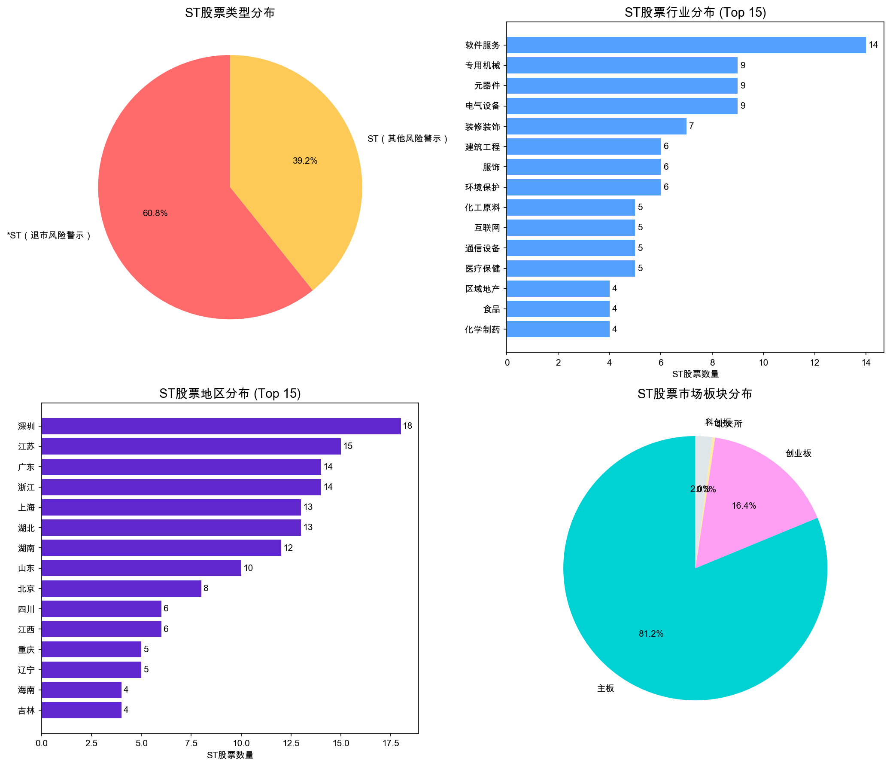
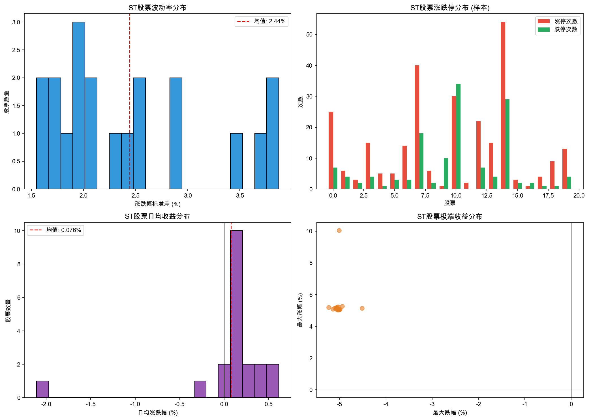

# ST股票特征研究综合报告

**生成时间：** 2026-02-01
**数据来源：** Tushare-DuckDB
**研究范围：** A股全市场ST股票

---

## 摘要

本报告基于Tushare数据库对A股市场ST股票进行全面研究，主要内容包括：
1. ST股识别与分类分析
2. ST效应与波动特征研究
3. 投资策略与风险控制

**核心发现：**
- 当前A股共有293只ST股票，占上市公司总数的5.35%
- *ST（退市风险警示）股票占ST总数的60.8%
- 2024年ST股票平均收益为-11.58%，大幅跑输上证指数（+13.15%）
- ST股票呈现高波动、高涨跌停频率特征
- 装修装饰、服饰、农业综合等行业ST占比最高

---

## 第一部分：ST股识别与分类

### 1.1 基础统计

| 统计项目 | 数值 |
|----------|------|
| A股上市公司总数 | 5,477 |
| ST股票总数 | 293 |
| ST股票占比 | 5.35% |
| *ST（退市风险警示） | 178只 (60.8%) |
| ST（其他风险警示） | 115只 (39.2%) |

### 1.2 ST类型说明

| 类型 | 前缀 | 触发条件 | 涨跌幅限制 |
|------|------|----------|------------|
| ST | ST | 其他风险警示（如违规等） | 5% |
| *ST | *ST | 退市风险警示（连续亏损等） | 5% |
| S*ST | S*ST | 未完成股改+退市风险 | 5% |

### 1.3 行业分布 (Top 10)

| 行业 | ST数量 | 行业总数 | ST占比 |
|------|--------|----------|--------|
| 软件服务 | 14 | 282 | 4.96% |
| 专用机械 | 9 | 282 | 3.19% |
| 元器件 | 9 | 301 | 2.99% |
| 电气设备 | 9 | 341 | 2.64% |
| 装修装饰 | 7 | 26 | **26.92%** |
| 建筑工程 | 6 | 129 | 4.65% |
| 服饰 | 6 | 65 | **9.23%** |
| 环境保护 | 6 | 121 | 4.96% |
| 化工原料 | 5 | 256 | 1.95% |
| 互联网 | 5 | 80 | 6.25% |

**高风险行业提示：** 装修装饰（26.92%）、服饰（9.23%）、农业综合（9.3%）行业ST占比显著偏高。

### 1.4 地区分布 (Top 10)

| 地区 | ST数量 |
|------|--------|
| 深圳 | 18 |
| 江苏 | 15 |
| 广东 | 14 |
| 浙江 | 14 |
| 上海 | 13 |
| 湖北 | 13 |
| 湖南 | 12 |
| 山东 | 10 |
| 北京 | 8 |
| 四川 | 6 |



---

## 第二部分：ST效应分析

### 2.1 2024年收益表现

| 统计指标 | ST股票 | 上证指数 |
|----------|--------|----------|
| 平均收益 | -11.58% | +13.15% |
| 中位数收益 | -21.59% | - |
| 最高收益 | +365.76% | - |
| 最低收益 | -64.60% | - |
| 上涨占比 | 25.1% | - |
| 下跌占比 | 74.9% | - |

**超额收益（ST vs 大盘）：-24.73%**

### 2.2 波动特征对比

| 指标 | ST股票 | 非ST股票 |
|------|--------|----------|
| 平均日涨跌幅 | 0.020% | 0.208% |
| 波动率(标准差) | 4.20% | 4.22% |
| 年均涨停天数 | 24.9天 | 5.1天 |
| 年均跌停天数 | 24.1天 | 2.4天 |

**关键发现：**
- ST股票日均收益率显著低于非ST股票
- ST股票涨跌停频率是非ST股票的5倍以上
- 波动率水平相当，但极端走势更频繁

### 2.3 市值分布

| 市值区间 | 数量 | 占比 |
|----------|------|------|
| <30亿元 | 91只 | 52.3% |
| 30-100亿元 | 71只 | 40.8% |
| >100亿元 | 12只 | 6.9% |

**市值统计：**
- 平均市值：47.6亿元
- 中位数市值：29.1亿元
- 最大市值：809.9亿元（*ST松发）
- 最小市值：7.3亿元

### 2.4 估值特征

| 估值指标 | ST股票 | 非ST股票 |
|----------|--------|----------|
| 平均PE(TTM) | 62.4 | 76.2 |
| PE中位数 | 55.7 | - |
| 平均PB | 5.31 | 4.10 |
| PB中位数 | 3.44 | - |

**估值观察：**
- ST股票PE整体低于非ST股票（多为亏损导致PE失真）
- ST股票PB略高于非ST股票均值




---

## 第三部分：策略研究

### 3.1 摘帽博弈策略

#### 策略逻辑
在ST股票有望摘帽前布局，等待摘帽后的估值修复。核心是判断公司基本面是否真正改善。

#### 摘帽条件（缺一不可）
1. 连续两个会计年度净利润为正
2. 净资产为正且每股净资产高于股票面值（1元）
3. 审计意见为标准无保留意见
4. 无其他导致ST的情形

#### 最佳布局时机
| 时机 | 说明 |
|------|------|
| 年报披露季前1-3月 | 通常4月30日前披露年报 |
| 业绩预盈公告后 | 确认扭亏预期 |
| 重组方案获批后 | 实质性利好落地 |

#### 历史收益特征
- **摘帽成功：** 通常有20%-50%的短期涨幅
- **摘帽失败：** 可能面临退市风险，损失惨重

#### 量化筛选指标
```
1. 最近两个季度净利润 > 0
2. 净资产 > 0
3. 营业收入同比增长 > 0
4. 无审计异常意见
5. 无重大诉讼或违规
```

### 3.2 ST股风险规避

#### 高危特征（应立即规避）
| 风险类型 | 具体表现 |
|----------|----------|
| 面值退市风险 | 股价低于1元 |
| 市值退市风险 | 连续20个交易日市值<3亿 |
| 审计风险 | 审计意见为否定/无法表示 |
| 监管风险 | 被证监会立案调查 |

#### 中危特征（需谨慎对待）
| 风险类型 | 具体表现 |
|----------|----------|
| 持续亏损 | 连续3年以上亏损 |
| 质押风险 | 大股东高比例质押 |
| 法律风险 | 多起诉讼缠身 |
| 经营风险 | 核心业务停滞 |

#### 风险规避清单
```
避免的ST股特征：
- 连续3年以上亏损
- 审计意见为保留/否定/无法表示
- 被证监会立案调查
- 资不抵债（净资产为负）
- 主营业务停滞
- 大股东持续减持
- 高管频繁变动
```

### 3.3 困境反转策略

#### 策略核心
寻找基本面出现实质性改善的ST公司，关注资产重组、债务重整、新业务注入。

#### 选股维度

**1. 重组预期**
| 类型 | 说明 | 成功概率 |
|------|------|----------|
| 国资入主 | 地方国资接盘 | 较高 |
| 产业整合 | 被同行优质企业收购 | 中等 |
| 借壳上市 | 优质资产注入 | 较低（注册制后） |

**2. 业务转型**
- 剥离亏损业务
- 切入新赛道（新能源、半导体等）
- 新管理团队带来的变革

**3. 债务重整**
- 债转股
- 债务豁免
- 资产出售偿债

#### 买入信号
1. 国资/战投入主公告
2. 债务重整方案获批
3. 核心资产出售回款
4. 新业务实质性突破

#### 风险控制
- 设置时间止损（6个月未见转机则退出）
- 严格仓位控制（单票不超过3%）
- 动态跟踪基本面变化

#### 量化筛选指标
```
1. PE < 行业平均（对于盈利公司）
2. PB < 1.5（相对低估）
3. 大股东持股比例稳定
4. 近期有增持公告
5. 有重组预期或国资入主
```

---

## 第四部分：风险提示

### 4.1 主要风险类型

| 风险类型 | 风险描述 | 应对措施 |
|----------|----------|----------|
| 退市风险 | *ST随时可能退市，股票归零 | 避免*ST股或严格止损 |
| 流动性风险 | 成交量小，连续跌停无法卖出 | 控制仓位，分批操作 |
| 信息不对称 | 财务数据可信度存疑 | 关注审计意见 |
| 估值风险 | 传统估值方法失效 | 使用PB估值 |
| 时间成本 | 困境反转周期长 | 设置时间止损 |

### 4.2 退市新规要点（2020年后）

| 退市类型 | 触发条件 |
|----------|----------|
| 面值退市 | 连续20个交易日收盘价<1元 |
| 市值退市 | 连续20个交易日市值<3亿元 |
| 财务退市 | 营收<1亿且净利润<0 |
| 审计退市 | 连续两年审计报告无法表示意见 |

### 4.3 投资建议

1. **ST股票属于高风险投资**，仅适合风险承受能力强的投资者
2. **严格控制仓位**：单只ST股不超过总仓位5%，ST板块总仓位不超过10%
3. **做好充分研究**：深入分析财务报表、审计意见、诉讼情况
4. **设置止损纪律**：亏损15%-20%坚决止损
5. **避免抄底退市股**：一旦确定退市，不要抱有侥幸心理

---

## 第五部分：当前ST股票市值排名 (Top 10)

| 代码 | 名称 | 总市值(亿) | 行业 |
|------|------|------------|------|
| 603268.SH | *ST松发 | 809.9 | - |
| 001270.SZ | *ST铖昌 | 324.2 | 半导体 |
| 600079.SH | ST人福 | 300.0 | - |
| 600777.SH | *ST新潮 | 282.2 | - |
| 000656.SZ | *ST金科 | 157.4 | 全国地产 |
| 002024.SZ | ST易购 | 143.6 | 电器连锁 |
| 603389.SH | *ST亚振 | 129.1 | - |
| 000697.SZ | ST炼石 | 123.8 | 航空 |
| 002647.SZ | *ST仁东 | 114.4 | - |
| 688076.SH | ST诺泰 | 114.4 | - |

---

## 附录

### 相关文件列表

| 文件名 | 说明 |
|--------|------|
| st_stock_research_report.md | ST股票基础研究报告 |
| st_deep_analysis_report.md | ST股票深度分析报告 |
| st_distribution.png | ST股票分布图表 |
| st_volatility.png | ST股票波动特征图 |
| st_deep_analysis.png | ST股票深度分析图表 |
| st_stock_research.py | 基础研究分析脚本 |
| st_stock_deep_analysis.py | 深度分析脚本 |

### 数据更新说明

- 本报告基于截至2026年1月30日的数据
- ST股票名单和状态会动态变化
- 建议定期更新数据并重新运行分析

---

**免责声明：** 本报告仅供研究参考，不构成投资建议。ST股票风险极高，投资需谨慎。
