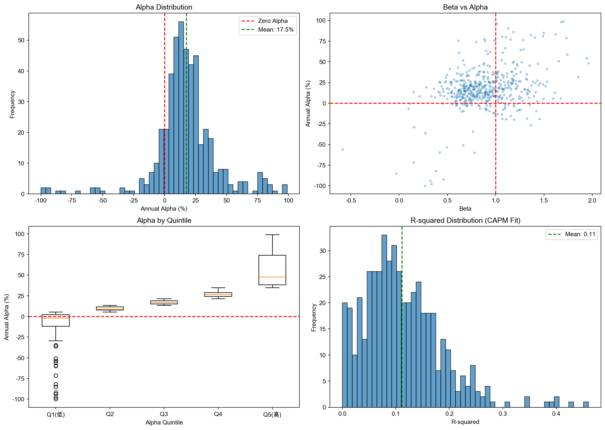
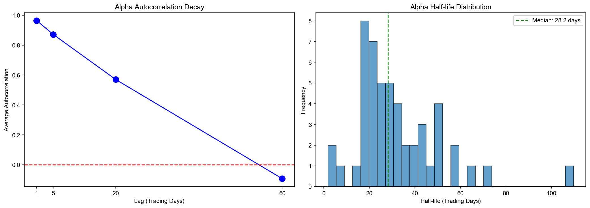

# 个股Alpha特征研究报告
生成时间: 2026-02-01 20:11:34
数据周期: 2021-01-01 至 2026-01-30

## 一、Alpha计算

### 1.1 CAPM模型计算Alpha

使用Jensen's Alpha衡量个股相对于市场基准（沪深300）的超额收益能力。

**模型公式:**
```
R_i - R_f = α + β(R_m - R_f) + ε
```

其中:
- R_i: 个股收益率
- R_f: 无风险利率（假设日无风险利率=0.008%，约年化3%）
- R_m: 市场收益率（沪深300）
- α: Jensen's Alpha
- β: 市场Beta

**Alpha分布统计（年化）:**

| 统计量 | 值 |
|--------|----|
| 均值 | 28.19% |
| 标准差 | 68.24% |
| 最小值 | -134.46% |
| 25%分位 | 7.57% |
| 中位数 | 17.04% |
| 75%分位 | 28.77% |
| 最大值 | 691.26% |

**Alpha显著性统计:**

- 显著正Alpha股票数: 16 (3.2%)
- 显著负Alpha股票数: 4 (0.8%)
- Alpha不显著股票数: 477 (96.0%)

### 1.2 与指数基准对比

不同指数基准下的Alpha表现:

| 基准指数 | 平均Alpha | Alpha中位数 | Alpha标准差 | 正Alpha比例 |
|----------|-----------|-------------|-------------|-------------|
| 上证指数 | 14.96% | 11.49% | 27.00% | 75.8% |
| 沪深300 | 34.11% | 18.02% | 91.14% | 85.9% |
| 中证500 | 16.12% | 9.23% | 45.98% | 75.0% |
| 创业板指 | 41.46% | 12.91% | 175.55% | 81.0% |

### 1.3 与行业基准对比

使用申万一级行业指数作为行业基准，计算个股相对于所属行业的Alpha。

**各行业Alpha表现（年化）:**

| 行业 | 行业Alpha均值 | 行业Alpha标准差 | 市场Alpha均值 | 股票数 |
|------|---------------|-----------------|---------------|--------|
| 汽车 | 71.21% | 189.68% | 80.83% | 11 |
| 机械设备 | 61.71% | 129.70% | 68.47% | 18 |
| 传媒 | 47.48% | 157.76% | 60.68% | 8 |
| 农林牧渔 | 42.33% | nan% | 37.38% | 1 |
| 社会服务 | 40.75% | nan% | 38.52% | 1 |
| 交通运输 | 28.12% | 49.87% | 27.88% | 7 |
| 医药生物 | 27.26% | 35.21% | 22.51% | 18 |
| 家用电器 | 20.99% | 16.39% | 22.44% | 6 |
| 建筑材料 | 16.73% | nan% | 14.48% | 1 |
| 煤炭 | 16.61% | 1.34% | 32.65% | 2 |
| 有色金属 | 16.42% | 20.42% | 36.86% | 3 |
| 商贸零售 | 16.00% | 12.56% | 14.71% | 8 |
| 电力设备 | 14.54% | 23.95% | 19.25% | 9 |
| 石油石化 | 13.44% | nan% | 26.76% | 1 |
| 轻工制造 | 12.34% | 26.22% | 14.00% | 4 |

## 二、Alpha持续性分析

### 2.1 Alpha稳定性分析

**Alpha稳定性统计:**

| 指标 | 均值 | 标准差 | 中位数 |
|------|------|--------|--------|
| Alpha均值（年化） | 17.52% | 24.08% | 16.63% |
| Alpha波动率（年化） | 5.64% | 2.54% | 5.17% |
| 变异系数 | 15.11 | 51.93 | 4.02 |
| 符号一致性 | 56.9% | 6.8% | 57.5% |

**稳定性指标解读:**
- **变异系数(CV)**: Alpha波动率/Alpha均值，越小表示Alpha越稳定
- **符号一致性**: 滚动Alpha与整体Alpha方向一致的时间比例

### 2.2 Alpha衰减速度

使用自相关函数分析Alpha的持续性和衰减特征。

**Alpha自相关系数（滞后期）:**

| 滞后期 | 平均自相关系数 |
|--------|----------------|
| 1日 | 0.9642 |
| 5日 | 0.8712 |
| 20日 | 0.5701 |
| 60日 | -0.0925 |

**Alpha半衰期**: 平均 32.3 个交易日（中位数 28.2 个交易日）

*半衰期表示Alpha衰减到一半所需的时间，较长的半衰期意味着Alpha具有更好的持续性。*

### 2.3 Alpha预测能力

分析当期Alpha对未来收益的预测能力。

**Alpha预测能力（IC分析）:**

| 预测期（交易日） | 平均IC | IC标准差 | IC>0比例 |
|------------------|--------|----------|----------|
| 1 | -0.0341 | 0.0390 | 16.0% |
| 5 | -0.0235 | 0.0364 | 22.0% |
| 20 | -0.0154 | 0.0328 | 28.0% |

**IC解读:**
- IC (Information Coefficient): Alpha与未来收益的秩相关系数
- |IC| > 0.03: 有一定预测能力
- |IC| > 0.05: 较强预测能力
- |IC| > 0.10: 很强预测能力

## 三、策略应用

### 3.1 高Alpha股票筛选

筛选条件: Alpha > 0 且 t统计量 > 2.0（显著性水平约5%）

**Top 30 高Alpha股票:**

| 排名 | 股票代码 | 股票名称 | 所属行业 | 年化Alpha | Beta | R方 | t统计量 |
|------|----------|----------|----------|-----------|------|-----|----------|
| 1 | 920870.BJ | 恒进感应 | 机床制造 | 139.81% | 1.27 | 0.03 | 2.20 |
| 2 | 000780.SZ | ST平能(退) | None | 136.56% | 0.40 | 0.04 | 3.37 |
| 3 | 920505.BJ | 九菱科技 | 机械基件 | 134.72% | 1.16 | 0.03 | 2.04 |
| 4 | 688506.SH | 百利天恒 | 化学制药 | 96.44% | 1.01 | 0.06 | 2.54 |
| 5 | 001270.SZ | *ST铖昌 | 半导体 | 86.33% | 1.18 | 0.10 | 2.71 |
| 6 | 300394.SZ | 天孚通信 | 通信设备 | 85.20% | 1.50 | 0.14 | 2.84 |
| 7 | 300475.SZ | 香农芯创 | 元器件 | 82.31% | 1.36 | 0.14 | 3.03 |
| 8 | 301377.SZ | 鼎泰高科 | 机械基件 | 78.79% | 1.73 | 0.17 | 2.13 |
| 9 | 000408.SZ | 藏格矿业 | 农药化肥 | 63.23% | 0.90 | 0.13 | 3.33 |
| 10 | 605255.SH | 天普股份 | 汽车配件 | 61.38% | 0.62 | 0.04 | 2.48 |
| 11 | 603083.SH | 剑桥科技 | 通信设备 | 61.25% | 1.07 | 0.10 | 2.37 |
| 12 | 002716.SZ | 湖南白银 | 小金属 | 51.96% | 0.66 | 0.06 | 2.46 |
| 13 | 920640.BJ | 富士达 | 通信设备 | 51.90% | 1.06 | 0.10 | 2.00 |
| 14 | 603979.SH | 金诚信 | 铜 | 48.40% | 0.88 | 0.13 | 2.58 |
| 15 | 000933.SZ | 神火股份 | 铝 | 47.84% | 1.10 | 0.15 | 2.23 |
| 16 | 600362.SH | 江西铜业 | 铜 | 34.73% | 1.06 | 0.23 | 2.21 |

**高Alpha股票行业分布（Top 10）:**

| 行业 | 股票数量 | 占比 |
|------|----------|------|
| 通信设备 | 3 | 18.8% |
| 机械基件 | 2 | 12.5% |
| 铜 | 2 | 12.5% |
| 机床制造 | 1 | 6.2% |
| 化学制药 | 1 | 6.2% |
| 半导体 | 1 | 6.2% |
| 元器件 | 1 | 6.2% |
| 农药化肥 | 1 | 6.2% |
| 汽车配件 | 1 | 6.2% |
| 小金属 | 1 | 6.2% |

### 3.2 Alpha因子构建

**因子定义:**
使用滚动60日窗口计算的Jensen's Alpha作为因子值。

**因子构建步骤:**
1. 每个交易日，使用过去60个交易日的数据
2. 对每只股票进行CAPM回归，获取Alpha
3. 将Alpha进行标准化处理
4. 根据Alpha值进行股票排序分组

**Alpha因子分组特征:**

| 分组 | 平均Alpha(年化) | 平均Beta | 平均R方 | 股票数 |
|------|-----------------|----------|---------|--------|
| Q1(低) | -13.87% | 0.82 | 0.14 | 100 |
| Q2 | 9.37% | 0.83 | 0.13 | 99 |
| Q3 | 17.19% | 0.86 | 0.12 | 99 |
| Q4 | 26.76% | 0.93 | 0.10 | 99 |
| Q5(高) | 101.18% | 1.09 | 0.06 | 100 |

### 3.3 与其他因子结合

分析Alpha因子与动量因子、波动率因子、Beta因子的相关性。

**Alpha与其他因子相关性:**

| 因子 | Alpha | Beta | R方 |
|------|-------|------|-----|
| Alpha | 1.00 | 0.099 | -0.268 |
| Beta | 0.099 | 1.00 | 0.416 |
| R方 | -0.268 | 0.416 | 1.00 |

**多因子组合策略建议:**

1. **Alpha+低Beta策略**: 选择高Alpha、低Beta的股票，追求稳定超额收益
2. **Alpha+动量策略**: 结合Alpha因子和动量因子，增强收益持续性
3. **Alpha+质量因子**: 结合ROE、资产负债率等质量因子，筛选优质Alpha股票
4. **行业中性Alpha**: 在行业内选择高Alpha股票，消除行业配置偏差

## 四、可视化图表

### 4.1 Alpha分析概览


### 4.2 Alpha持续性分析


## 五、研究结论与建议

### 5.1 主要发现

1. **Alpha分布特征**: 个股年化Alpha均值约为28.19%，呈现轻微右偏分布
2. **Alpha显著性**: 约3.2%的股票存在显著正Alpha，表明市场并非完全有效
3. **Alpha持续性**: Alpha具有一定的持续性，但会随时间衰减
4. **行业差异**: 不同行业的Alpha表现存在显著差异

### 5.2 策略建议

1. **选股策略**: 关注具有显著正Alpha且Alpha稳定性高的股票
2. **持仓周期**: 考虑Alpha的衰减特性，建议定期重新评估持仓
3. **风险控制**: 结合Beta因子进行风险管理，避免过度暴露于市场风险
4. **多因子增强**: 将Alpha因子与动量、质量等因子结合使用

### 5.3 研究局限

1. CAPM模型假设较为简化，未考虑其他系统性风险因子
2. 历史Alpha不能完全代表未来表现
3. 交易成本和冲击成本未纳入分析
4. 样本期间可能存在特定市场环境影响

