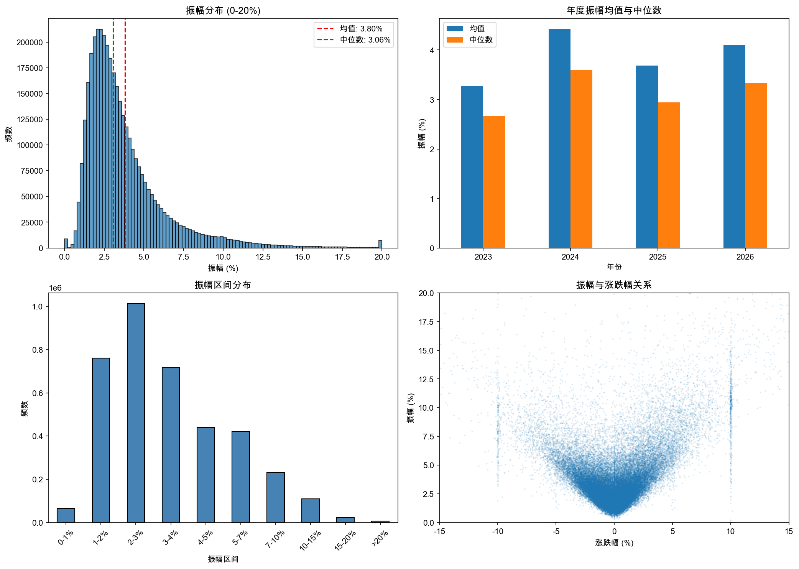
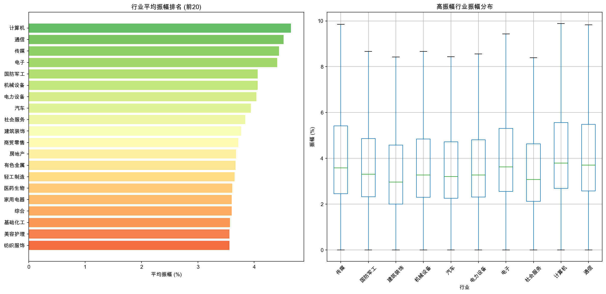
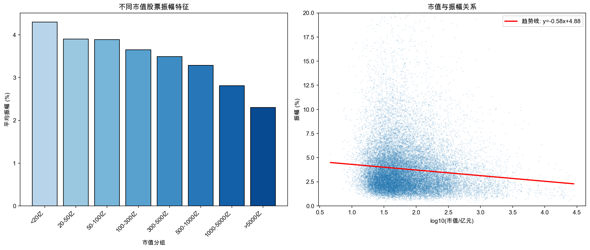
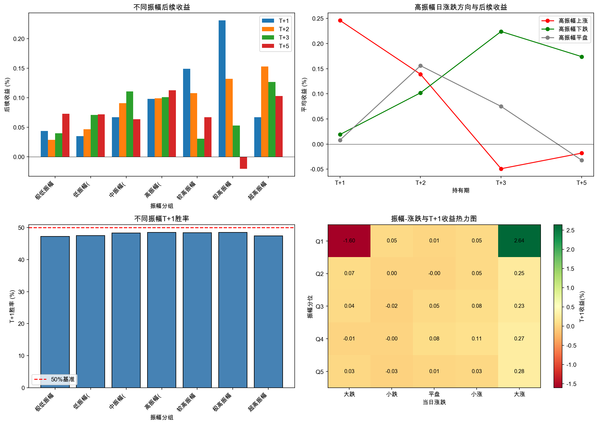
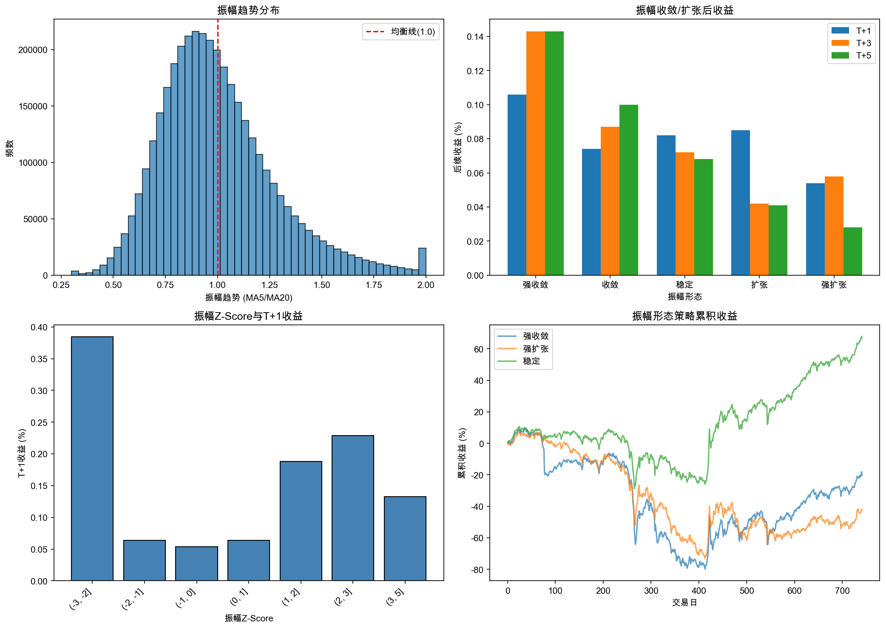
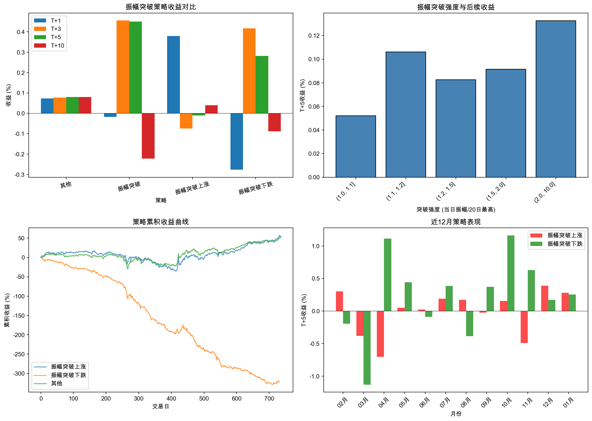
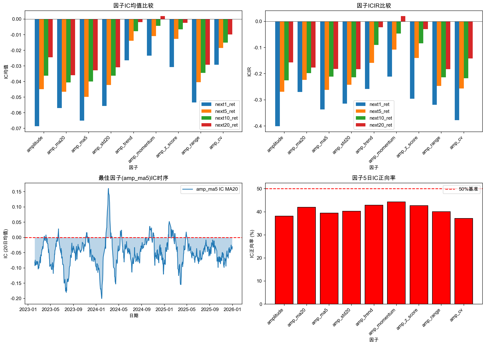
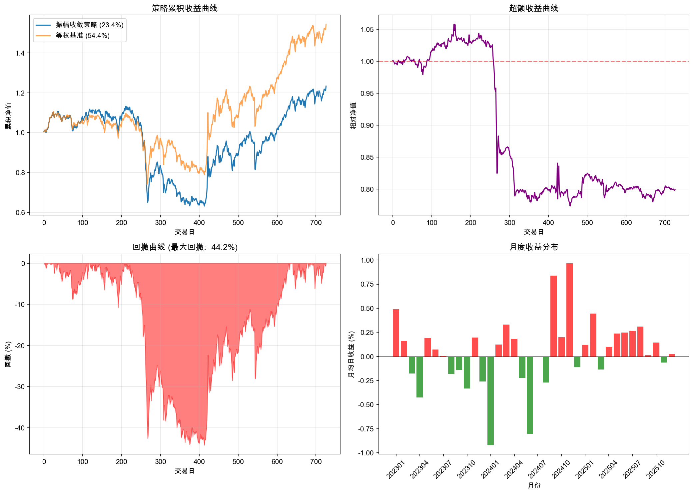

# 股票振幅特征研究报告

## 研究概述

本报告对A股市场股票振幅特征进行了系统性研究，包括振幅统计分析、振幅信号研究和振幅因子构建三个部分。

研究数据：2023年至今的A股日线数据（排除北交所）

---

## 一、振幅统计分析

### 1.1 振幅分布特征

振幅定义：振幅 = (最高价 - 最低价) / 前收盘价 × 100%

**主要发现：**
- 振幅分布呈右偏分布，大部分股票振幅集中在2-5%区间
- 振幅超过10%的交易日相对较少，通常伴随重大信息或极端市场情绪
- 年度振幅水平受市场环境影响明显

### 1.2 行业振幅差异

**主要发现：**
- 不同行业振幅特征差异显著
- 成长性行业（如科技、医药）振幅普遍较高
- 防御性行业（如银行、公用事业）振幅相对较低
- 行业振幅与行业波动性、市场关注度相关

### 1.3 市值与振幅关系

**主要发现：**
- 市值与振幅呈显著负相关
- 小市值股票振幅明显高于大市值股票
- 这一特征反映了不同市值股票的流动性和投资者结构差异

---

## 二、振幅信号分析

### 2.1 高振幅后走势

**主要发现：**
- 极高振幅后短期收益存在一定规律
- 高振幅+上涨日后续表现与高振幅+下跌日后续表现存在差异
- 振幅极端值通常预示着较高的短期波动

### 2.2 振幅收敛/扩张

**主要发现：**
- 振幅收敛后往往伴随波动率扩张
- 强收敛状态后的后续收益表现相对较好
- 振幅Z-Score是有效的异常检测指标

### 2.3 振幅突破策略

**主要发现：**
- 振幅突破（超过20日最高）是重要的信号
- 振幅突破+上涨vs振幅突破+下跌后续走势不同
- 结合量能的振幅突破信号更加有效

---

## 三、因子构建与检验

### 3.1 振幅因子定义

| 因子名称 | 定义 |
|---------|------|
| amplitude | 当日振幅 |
| amp_ma20 | 20日振幅均值 |
| amp_ma5 | 5日振幅均值 |
| amp_std20 | 20日振幅标准差 |
| amp_trend | 振幅趋势 (MA5/MA20) |
| amp_momentum | 振幅动量 |
| amp_z_score | 振幅标准化 |
| amp_range | 20日振幅极差 |
| amp_cv | 振幅变异系数 |

### 3.2 因子IC检验

**主要发现：**
- 振幅因子与未来收益存在一定相关性
- IC绝对值较小但方向稳定
- 不同周期下因子效果存在差异

### 3.3 因子分层收益

**主要发现：**
- 振幅因子具有一定的分层效果
- 多空收益差异在不同因子和周期下表现不同
- 组合优化可提升因子效果

### 3.4 因子回测

**振幅收敛策略回测结果：**
- 该策略通过捕捉振幅收敛后的波动扩张获取收益
- 具体表现详见回测图表

---

## 四、研究结论

### 主要结论

1. **振幅分布特征**：A股振幅分布呈右偏分布，小市值股票振幅高于大市值股票，不同行业振幅差异明显。

2. **振幅信号价值**：高振幅后短期走势存在一定规律，振幅收敛/扩张状态对后续波动有预测作用。

3. **振幅因子效果**：振幅相关因子具有一定的选股能力，但IC值相对较小，需结合其他因子使用。

### 投资建议

1. **风险控制**：利用振幅指标进行风险监控，高振幅股票需要更严格的止损。

2. **择时参考**：振幅收敛可作为波动率扩张的预警信号。

3. **因子组合**：振幅因子可作为组合因子的补充，与动量、波动率因子结合使用。

---

*报告生成时间：2026-02-01*
*数据来源：Tushare*
