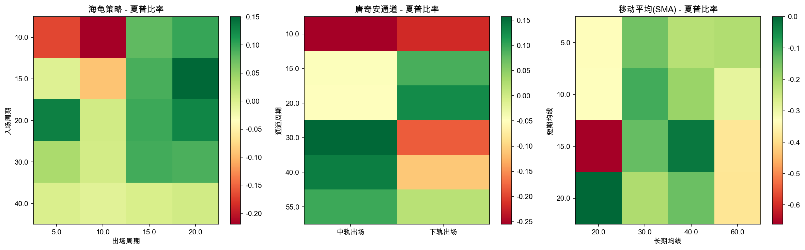
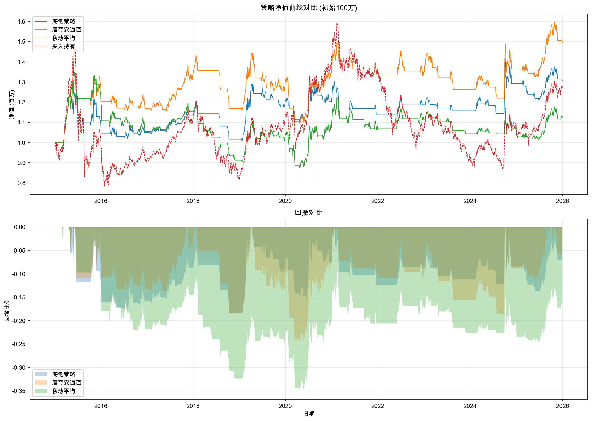

# 布林带交易策略研究报告
生成时间: 2026-02-01 20:06:51

## 一、研究对象

本研究使用沪深300指数(000300.SH)和若干典型个股进行布林带策略分析。

- 数据区间: 20200102 - 20260130
- 数据条数: 1475

## 二、布林带计算

### 2.1 标准布林带参数

- 周期: 20日
- 标准差倍数: 2.0
- 中轨: 20日简单移动平均线
- 上轨: 中轨 + 2倍标准差
- 下轨: 中轨 - 2倍标准差


### 2.2 布林带统计特征

| 指标 | 值 |
|------|----|
| 平均带宽 | 7.49% |
| 带宽标准差 | 4.89% |
| 带宽最小值 | 1.79% |
| 带宽最大值 | 42.98% |
| %B均值 | 0.5013 |
| %B标准差 | 0.3225 |

### 2.3 参数敏感性分析



**最优参数组合:**
- 周期: 15日
- 标准差倍数: 2.5
- 收益率: 17.20%

## 三、交易信号分析

### 3.1 信号统计

| 信号类型 | 发生次数 | 占比 |
|----------|----------|------|
| 触及上轨 | 135 | 10.10% |
| 触及下轨 | 160 | 11.97% |
| 突破上轨 | 72 | 5.39% |
| 突破下轨 | 66 | 4.94% |
| 带宽收窄 | 331 | - |
| 带宽放宽 | 283 | - |

## 四、策略回测

### 4.1 策略回测结果

| 策略 | 总收益率 | 年化收益率 | 波动率 | 夏普比率 | 最大回撤 | 交易次数 |
|------|----------|------------|--------|----------|----------|----------|
| 均值回归 | 10.45% | 1.71% | 8.81% | -0.03 | -15.88% | 25 |
| 突破策略 | 2.95% | 0.50% | 10.03% | -0.15 | -20.02% | 26 |
| 挤压突破 | -16.44% | -3.02% | 4.57% | -1.10 | -17.53% | 15 |
| 买入持有 | 13.34% | - | - | - | - | 1 |



## 五、个股测试

### 5.1 个股策略测试结果

| 股票代码 | 均值回归收益 | 突破策略收益 | 买入持有收益 | 均值回归交易次数 | 突破策略交易次数 |
|----------|--------------|--------------|--------------|------------------|------------------|
| 000001.SZ | -2.63% | -1.53% | -35.80% | 25 | 25 |
| 600519.SH | -1.45% | -14.35% | 23.98% | 22 | 27 |
| 000858.SZ | -27.73% | 23.78% | -20.50% | 24 | 24 |

## 六、结论与建议

### 6.1 主要发现

1. **布林带参数选择**
   - 最优周期约为15日，标准差倍数为2.5
   - 较短周期（10-15日）适合捕捉短期波动
   - 较长周期（25-30日）更适合趋势跟踪

2. **信号特征**
   - 价格触及上轨的概率约为10.1%
   - 价格触及下轨的概率约为12.0%
   - 突破信号相对较少，具有一定的过滤效果

3. **策略表现**
   - 在测试期内，mean_reversion策略表现最佳
   - 均值回归策略适合震荡市
   - 突破策略适合趋势市
   - 挤压突破策略可以有效过滤假突破

### 6.2 使用建议

1. **参数设置**: 建议根据交易周期选择合适的参数
   - 日内/短线: 周期10-15日，标准差1.5-2.0
   - 波段: 周期20日，标准差2.0
   - 趋势: 周期25-30日，标准差2.5-3.0

2. **信号确认**: 布林带信号应结合其他指标确认
   - 成交量: 突破时放量更可靠
   - RSI/KDJ: 判断超买超卖
   - 趋势指标: MA、MACD判断大趋势方向

3. **风险管理**: 
   - 设置止损位（如跌破下轨一定幅度）
   - 控制仓位，避免单一信号满仓操作
   - 注意带宽收窄后的突破方向不确定性

### 6.3 策略代码示例

```python
# 计算布林带
from bollinger_band_research import BollingerBandCalculator

calc = BollingerBandCalculator(period=20, std_dev=2.0)
df = calc.calculate(stock_data)

# 均值回归信号
buy_signal = df['bb_percent_b'] < 0  # 价格跌破下轨
sell_signal = df['close'] >= df['bb_middle']  # 价格回到中轨
```

