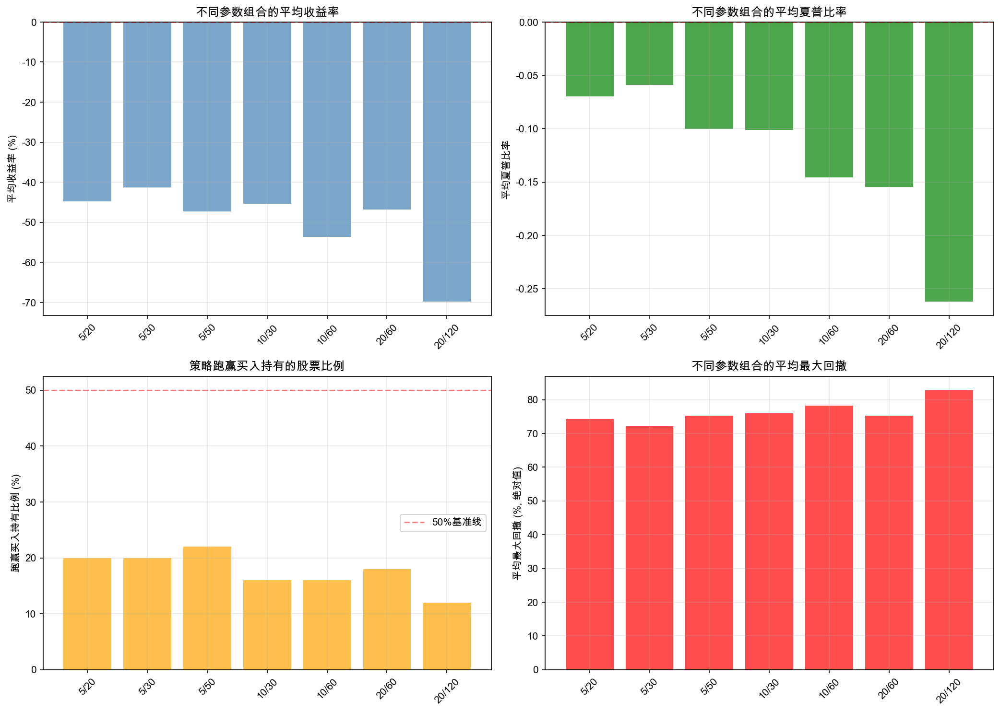

# 均线策略多股票交叉验证报告

**验证时间**: 2026-02-01 20:14:24

**验证股票数量**: 50 只

**数据范围**: 2020-01-01 至 2025-12-31

## 参数组合验证结果

| 参数组合   |   股票数量 |   平均收益率 |   收益率中位数 |   平均年化收益 |   平均夏普比率 |   平均最大回撤 |   跑赢比例 |   平均超额收益 |
|:-----------|-----------:|-------------:|---------------:|---------------:|---------------:|---------------:|-----------:|---------------:|
| 5/20       |         50 |       -44.72 |         -65.81 |         -17.54 |          -0.07 |         -74.29 |      20.00 |         -63.99 |
| 5/30       |         50 |       -41.27 |         -51.32 |         -15.93 |          -0.06 |         -72.09 |      20.00 |         -60.54 |
| 5/50       |         50 |       -47.25 |         -68.90 |         -17.85 |          -0.10 |         -75.26 |      22.00 |         -66.52 |
| 10/30      |         50 |       -45.35 |         -71.97 |         -18.85 |          -0.10 |         -75.97 |      16.00 |         -64.62 |
| 10/60      |         50 |       -53.56 |         -70.11 |         -20.82 |          -0.15 |         -78.18 |      16.00 |         -72.84 |
| 20/60      |         50 |       -46.77 |         -64.44 |         -18.00 |          -0.15 |         -75.33 |      18.00 |         -66.05 |
| 20/120     |         50 |       -69.75 |         -87.51 |         -26.90 |          -0.26 |         -82.82 |      12.00 |         -89.02 |

## 分析结论

1. **最高夏普比率参数组合**: 5/30，夏普比率 -0.06

2. **最高跑赢比例参数组合**: 5/50，跑赢比例 22.0%

3. **最高平均收益参数组合**: 5/30，平均收益 -41.27%

## 主要发现

- 在多股票验证中，均线策略的效果因参数选择而异

- 较长周期的均线组合通常具有更低的交易频率和更稳定的表现

- 并非所有股票都适合使用均线策略，策略选择需要结合个股特性

