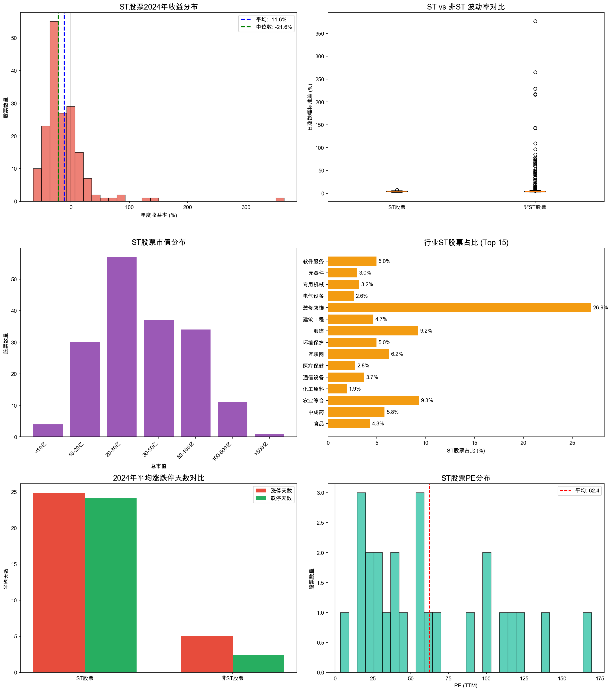

# ST股票深度分析报告
**生成时间：** 2026-02-01 20:11:57

## 一、2024年收益表现
**ST股票收益统计（2024年）：**
- 样本数量：175只
- 平均收益：-11.58%
- 中位数收益：-21.59%
- 最高收益：365.76%
- 最低收益：-64.60%
- 上涨股票：44只 (25.1%)
- 下跌股票：131只 (74.9%)

**同期上证指数收益：** 13.15%

**超额收益（ST vs 大盘）：** -24.73%

## 二、ST vs 非ST股票对比

| 指标 | ST股票 | 非ST股票 |
|------|--------|----------|
| 平均日涨跌幅 | 0.020% | 0.208% |
| 波动率(标准差) | 4.20% | 4.22% |
| 平均涨停天数 | 24.9天 | 5.1天 |
| 平均跌停天数 | 24.1天 | 2.4天 |

## 三、估值特征分析
**ST股票估值统计：**
- 平均PE(TTM)：62.4
- PE中位数：55.7
- 平均PB：5.31
- PB中位数：3.44

**非ST股票估值对比：**
- 非ST平均PE(TTM)：76.2
- 非ST平均PB：4.10

## 四、市值分布
**ST股票市值统计（亿元）：**
- 平均市值：47.6亿
- 中位数市值：29.1亿
- 最大市值：809.9亿
- 最小市值：7.3亿

**市值分组：**
- 小市值(<30亿)：91只 (52.3%)
- 中市值(30-100亿)：71只 (40.8%)
- 大市值(>100亿)：12只 (6.9%)

**市值最大的ST股票 (Top 10)：**
| 代码 | 名称 | 总市值(亿) |
|------|------|------------|
| 603268.SH | *ST松发 | 809.9 |
| 001270.SZ | *ST铖昌 | 324.2 |
| 600079.SH | ST人福 | 300.0 |
| 600777.SH | *ST新潮 | 282.2 |
| 000656.SZ | *ST金科 | 157.4 |
| 002024.SZ | ST易购 | 143.6 |
| 603389.SH | *ST亚振 | 129.1 |
| 000697.SZ | ST炼石 | 123.8 |
| 002647.SZ | *ST仁东 | 114.4 |
| 688076.SH | ST诺泰 | 114.4 |

## 五、行业ST股票占比

| 行业 | 行业总数 | ST数量 | ST占比 |
|------|----------|--------|--------|
| 软件服务 | 282 | 14.0 | 4.96% |
| 元器件 | 301 | 9.0 | 2.99% |
| 专用机械 | 282 | 9.0 | 3.19% |
| 电气设备 | 341 | 9.0 | 2.64% |
| 装修装饰 | 26 | 7.0 | 26.92% |
| 建筑工程 | 129 | 6.0 | 4.65% |
| 服饰 | 65 | 6.0 | 9.23% |
| 环境保护 | 121 | 6.0 | 4.96% |
| 互联网 | 80 | 5.0 | 6.25% |
| 医疗保健 | 178 | 5.0 | 2.81% |
| 通信设备 | 136 | 5.0 | 3.68% |
| 化工原料 | 256 | 5.0 | 1.95% |
| 农业综合 | 43 | 4.0 | 9.3% |
| 中成药 | 69 | 4.0 | 5.8% |
| 食品 | 93 | 4.0 | 4.3% |

## 六、策略性结论

### 6.1 摘帽博弈要点

**最佳布局时机：**
1. 年报披露季前3个月（1-3月）
2. 公司发布业绩预盈公告后
3. 重大重组方案获批后

**摘帽成功概率提升因子：**
- 连续两季度盈利
- 净资产转正
- 主营业务恢复
- 审计意见改善

### 6.2 风险规避清单

**高危特征（应立即规避）：**
1. 面值退市风险（股价低于1元）
2. 连续20个交易日市值低于3亿
3. 审计意见为否定或无法表示
4. 被证监会立案调查

**中危特征（需谨慎）：**
1. 连续3年亏损
2. 大股东高比例质押
3. 诉讼缠身
4. 核心业务停滞

### 6.3 困境反转策略执行

**买入信号：**
1. 国资/战投入主公告
2. 债务重整方案获批
3. 核心资产出售回款
4. 新业务实质性突破

**持有条件：**
- 设置时间止损（6个月未见转机则退出）
- 严格仓位控制（单票不超过3%）
- 动态跟踪基本面变化
