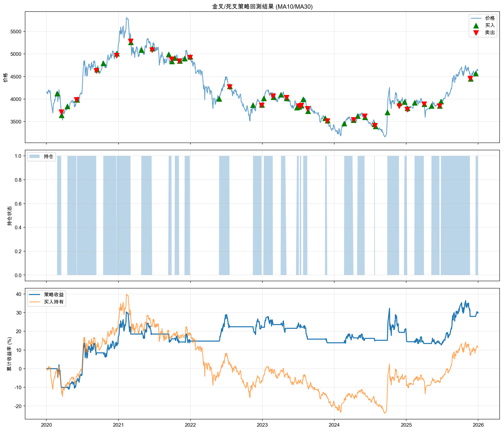
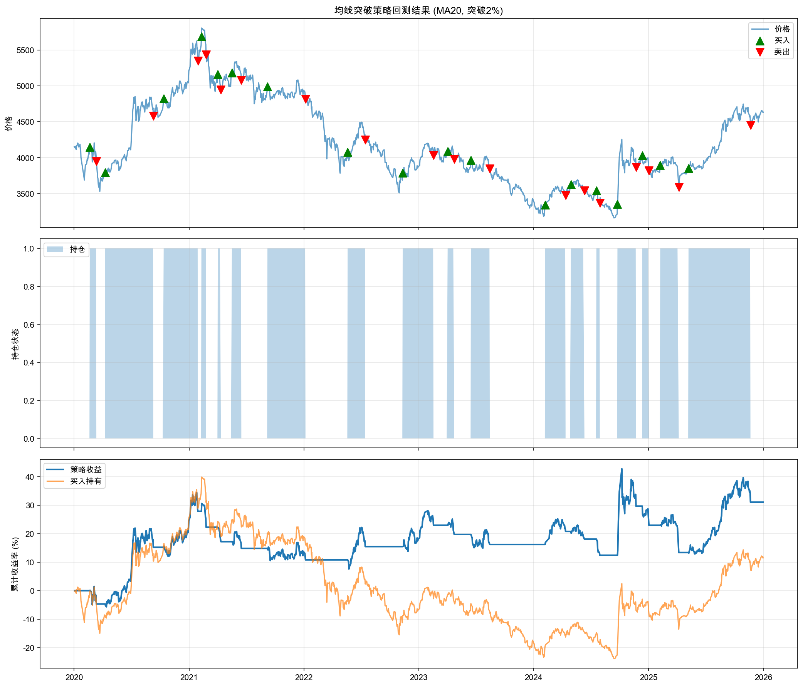
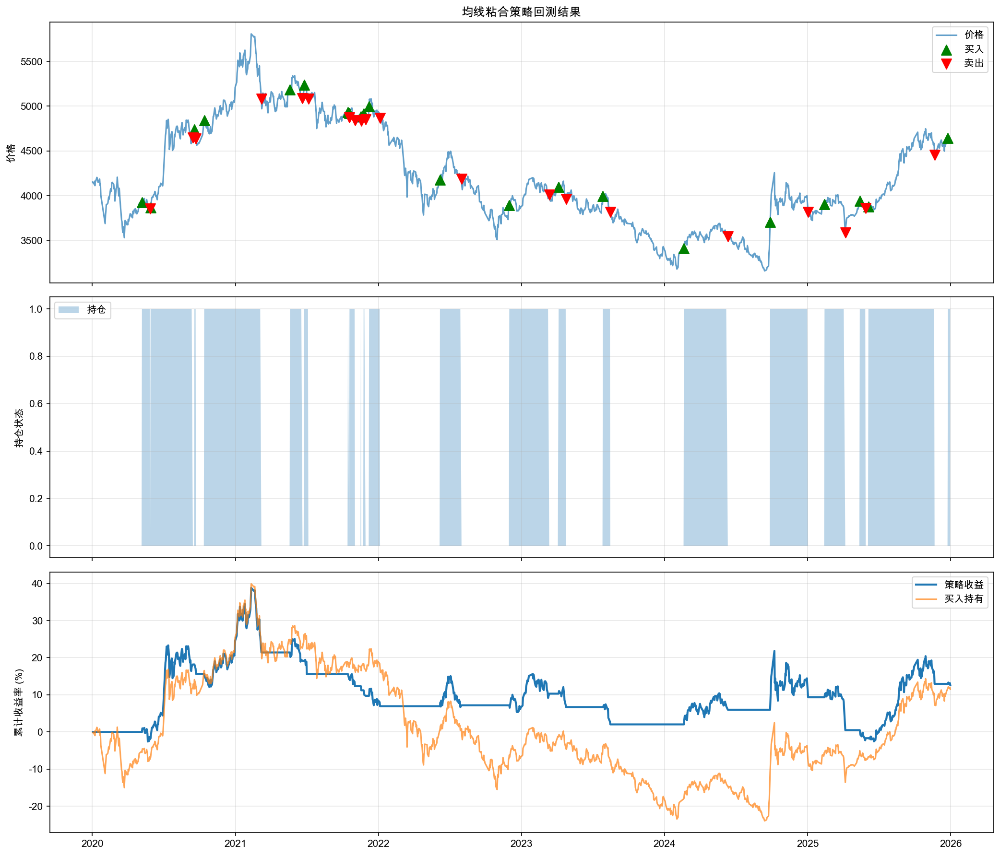
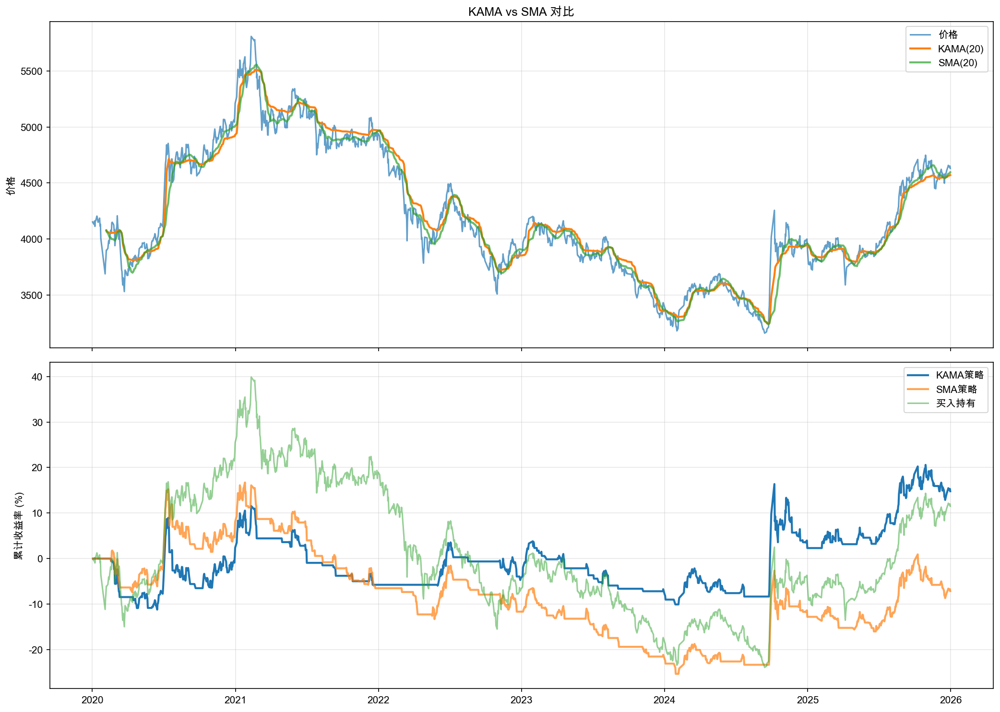

# 均线交易系统研究报告

**研究标的**: 000300.SH
**数据范围**: 2020-01-02 至 2025-12-31
**数据量**: 1455 个交易日
**报告生成时间**: 2026-02-01 20:09:10

---

## 1. 均线参数测试

### 1.1 单均线系统

**策略规则**: 价格上穿均线买入，价格下穿均线卖出

|   均线周期 |   总收益率 |   年化收益率 |   夏普比率 |   最大回撤 |   交易次数 |   胜率 |
|-----------:|-----------:|-------------:|-----------:|-----------:|-----------:|-------:|
|       5.00 |      26.68 |         4.18 |       0.38 |     -27.98 |     368.00 |  50.00 |
|      10.00 |       5.94 |         1.01 |       0.14 |     -33.81 |     255.00 |  49.04 |
|      20.00 |      -7.14 |        -1.28 |      -0.03 |     -36.03 |     187.00 |  49.49 |
|      30.00 |      27.14 |         4.25 |       0.38 |     -23.31 |     135.00 |  51.84 |
|      60.00 |      55.38 |         7.93 |       0.65 |     -19.84 |      75.00 |  53.11 |
|     120.00 |      11.79 |         1.95 |       0.22 |     -32.72 |      53.00 |  50.78 |

### 1.2 双均线交叉系统

**策略规则**: 短期均线上穿长期均线买入（金叉），短期均线下穿长期均线卖出（死叉）

|   短期均线 |   长期均线 | 参数组合   |   总收益率 |   年化收益率 |   夏普比率 |   最大回撤 |   交易次数 |
|-----------:|-----------:|:-----------|-----------:|-------------:|-----------:|-----------:|-----------:|
|          5 |         20 | 5/20       |      -1.57 |        -0.27 |       0.05 |     -31.57 |        105 |
|          5 |         30 | 5/30       |      15.55 |         2.54 |       0.26 |     -20.49 |         71 |
|          5 |         60 | 5/60       |      12.65 |         2.08 |       0.22 |     -29.78 |         41 |
|          5 |        120 | 5/120      |       2.37 |         0.41 |       0.09 |     -34.03 |         31 |
|         10 |         20 | 10/20      |      24.14 |         3.82 |       0.35 |     -18.40 |         85 |
|         10 |         30 | 10/30      |      29.69 |         4.61 |       0.41 |     -14.85 |         51 |
|         10 |         60 | 10/60      |       1.62 |         0.28 |       0.09 |     -38.49 |         31 |
|         10 |        120 | 10/120     |       0.43 |         0.07 |       0.07 |     -38.25 |         21 |
|         20 |         30 | 20/30      |      -8.38 |        -1.50 |      -0.05 |     -38.70 |         55 |
|         20 |         60 | 20/60      |       7.42 |         1.25 |       0.16 |     -38.61 |         32 |
|         20 |        120 | 20/120     |      -1.03 |        -0.18 |       0.04 |     -36.20 |         17 |

### 1.3 三均线系统（多头排列）

**策略规则**: 短期均线 > 中期均线 > 长期均线时持仓（多头排列）

|   短期均线 |   中期均线 |   长期均线 | 参数组合   |   总收益率 |   年化收益率 |   夏普比率 |   最大回撤 |   交易次数 |
|-----------:|-----------:|-----------:|:-----------|-----------:|-------------:|-----------:|-----------:|-----------:|
|          5 |         10 |         20 | 5/10/20    |     -12.81 |        -2.35 |      -0.16 |     -31.32 |        127 |
|          5 |         10 |         30 | 5/10/30    |       1.35 |         0.23 |       0.08 |     -19.25 |        105 |
|          5 |         20 |         60 | 5/20/60    |     -11.22 |        -2.04 |      -0.17 |     -34.56 |         76 |
|         10 |         20 |         60 | 10/20/60   |      -3.62 |        -0.64 |      -0.01 |     -34.12 |         58 |
|         10 |         30 |         60 | 10/30/60   |      19.05 |         3.07 |       0.35 |     -24.55 |         38 |
|         20 |         60 |        120 | 20/60/120  |       5.86 |         0.99 |       0.15 |     -21.98 |         20 |

### 1.4 最优参数搜索

**搜索范围**: 短期均线 5-60，长期均线 5-60，步长 5

**优化目标**: 夏普比率

**最优参数组合**:

- 短期均线: 5

- 长期均线: 50

- 总收益率: 39.03%

- 年化收益率: 5.87%

- 夏普比率: 0.51

- 最大回撤: -22.46%

---

## 2. 均线策略回测

### 2.1 金叉/死叉策略

**参数**: 短期均线 MA10，长期均线 MA30

- 总收益率: 29.69%

- 胜率: 44.00%

- 平均每笔收益: 1.12%

- 总交易次数: 25

**最近10笔交易记录**:

| buy_date            | sell_date           |   buy_price |   sell_price |   profit |
|:--------------------|:--------------------|------------:|-------------:|---------:|
| 2023-07-28 00:00:00 | 2023-08-18 00:00:00 |     3992.74 |      3784.00 |    -5.23 |
| 2023-11-16 00:00:00 | 2023-11-27 00:00:00 |     3572.36 |      3511.94 |    -1.69 |
| 2024-02-21 00:00:00 | 2024-04-08 00:00:00 |     3456.87 |      3536.41 |     2.30 |
| 2024-04-29 00:00:00 | 2024-06-04 00:00:00 |     3623.91 |      3615.67 |    -0.23 |
| 2024-07-23 00:00:00 | 2024-07-26 00:00:00 |     3439.88 |      3409.29 |    -0.89 |
| 2024-09-27 00:00:00 | 2024-11-26 00:00:00 |     3703.68 |      3840.18 |     3.69 |
| 2024-12-23 00:00:00 | 2025-01-06 00:00:00 |     3933.57 |      3768.97 |    -4.18 |
| 2025-02-12 00:00:00 | 2025-04-01 00:00:00 |     3919.86 |      3887.68 |    -0.82 |
| 2025-05-09 00:00:00 | 2025-06-19 00:00:00 |     3846.16 |      3843.09 |    -0.08 |
| 2025-06-26 00:00:00 | 2025-11-21 00:00:00 |     3946.02 |      4453.61 |    12.86 |

### 2.2 均线突破策略

**参数**: 均线周期 MA20，突破阈值 2%

- 总收益率: 31.06%

- 胜率: 38.89%

- 总交易次数: 18

### 2.3 均线粘合策略

**参数**: 均线组合 MA5/10/20/60，粘合阈值 2%

- 总收益率: 12.65%

- 胜率: 35.00%

- 总交易次数: 20

---

## 3. 策略优化

### 3.1 带过滤条件的均线策略

**过滤条件**:

1. 趋势过滤：只在价格高于MA60时做多

2. ATR过滤：波动率（ATR/价格）< 5%时交易

3. 价格位置过滤：价格偏离短期均线不超过10%

| 指标 | 优化策略 | 基础策略 | 改善 |

|------|----------|----------|------|

| 总收益率 | 27.64% | 29.69% | -2.05% |

| 夏普比率 | 0.44 | 0.41 | 0.04 |

| 最大回撤 | -19.57% | -14.85% | -4.71% |

### 3.2 结合成交量的均线策略

**策略规则**: 金叉时需成交量放大1.5倍以上才确认买入

| 指标 | 成交量确认策略 | 基础策略 | 改善 |

|------|----------------|----------|------|

| 总收益率 | -1.73% | 29.69% | -31.43% |

| 胜率 | 50.00% | - | - |

| 交易次数 | 2 | - | - |

### 3.3 自适应均线策略 (KAMA)

**KAMA参数**: 效率比率周期=20，快速平滑周期=2，慢速平滑周期=30

| 指标 | KAMA策略 | SMA策略 | 改善 |

|------|----------|---------|------|

| 总收益率 | 14.79% | -7.14% | 21.94% |

| 夏普比率 | 0.25 | -0.03 | 0.29 |

| 交易次数 | 157 | 187 | 30 |

---

## 4. 研究总结

### 4.1 主要发现

1. **单均线系统**: 简单但容易产生频繁交易和假信号，较长周期的均线表现更稳定

2. **双均线系统**: 通过金叉死叉可以有效过滤一些噪声，但在震荡行情中仍会产生亏损

3. **多均线系统**: 多头排列策略相对保守，能抓住主要趋势，但可能错过一些机会

4. **均线突破策略**: 设置合适的突破阈值可以减少假突破，但也可能错过一些真正的突破

5. **均线粘合策略**: 粘合后发散是较好的入场时机，但识别粘合状态需要较多经验

6. **过滤条件**: 趋势过滤、波动率过滤可以有效提高策略质量

7. **成交量确认**: 金叉时成交量放大确认可以提高信号的可靠性

8. **自适应均线**: KAMA能够在趋势和震荡行情中自动调整灵敏度，减少交易次数

### 4.2 最优策略建议

基于本次研究，推荐的参数组合为:

- **双均线系统最优参数**: MA5/MA50，夏普比率 0.51

- **建议加入的过滤条件**: 趋势过滤(MA60)、成交量确认(1.5倍放大)

- **考虑使用自适应均线(KAMA)**: 可以减少交易次数同时保持策略效果

### 4.3 风险提示

1. 以上研究基于历史数据，不代表未来表现

2. 均线策略在趋势行情中表现较好，但在震荡行情中可能产生较多亏损

3. 实际交易需考虑交易成本、滑点、流动性等因素

4. 建议结合其他指标和基本面分析综合判断

